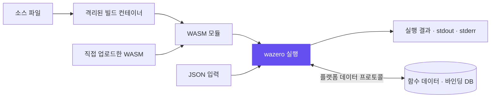

<div align="center">

# Return Cloud Platform

### 학생의 아이디어가 서비스가 되는 곳

**VM 생성부터 터미널 접속, 파일 저장, 함수 실행까지.**
경희대학교 학술동아리 **RETURN**이 만드는 학생을 위한 클라우드 플랫폼.

[](https://khu-return.com)
[](https://github.com/KHU-RETURN/rcp-server)


[프로젝트 소개](#about) · [주요 기능](#features) · [아키텍처](#architecture) · [개발 시작](#development) · [운영 레퍼런스](#operations)

</div>

---

<a id="about"></a>

## 프로젝트를 위한 클라우드, 직접 만들고 운영합니다

RCP는 학생이 수업과 팀 프로젝트에서 **컴퓨팅 자원을 만들고, 접속하고, 배포를 실습**할 수 있도록 돕는 플랫폼입니다. `rcp-server`는 웹 콘솔 뒤에서 인증, OpenStack 리소스 관리, VM 접속, WASM 함수 실행을 담당하는 **Go 백엔드**입니다.

단순히 인프라 API를 연결하는 데서 끝나지 않고, 사용자 인증부터 tenant 네트워크 접속과 격리된 함수 실행까지 하나의 사용 흐름으로 연결합니다.

| 리소스 준비 | 개발과 접속 | 실행과 데이터 |
| :--- | :--- | :--- |
| VM·볼륨·오브젝트 저장소 관리 | 브라우저 터미널·SSH 게이트웨이 | WASM Functions·SQLite 바인딩 |
| 프로젝트에 필요한 인프라 마련 | 실행 중인 환경에 직접 접근 | 함수 호출과 데이터 저장 |

> **이 저장소의 범위**
> RCP의 API 서버 및 게이트웨이·함수 빌더를 포함합니다. 아래 기능은 현재 백엔드 구현 기준이며, 웹 콘솔의 메뉴 노출과 제공 범위는 배포 상태에 따라 다를 수 있습니다. 공개 랜딩의 Database·Network 항목은 구현 중으로 안내되며, 아래 SQLite 기능은 함수용 데이터 기능입니다.

<a id="features"></a>

## 하나의 플랫폼으로 연결되는 기능

| 영역 | 구현된 기능 | 사용자 경험 |
| :--- | :--- | :--- |
| **Compute** | Flavor 조회, VM 생성·조회·수정·삭제, 일시정지·재개 | 프로젝트에 맞는 가상 머신 관리 |
| **Access** | 키페어 관리, 웹 콘솔 세션, OAuth 기반 SSH 접속 | 브라우저 또는 터미널에서 내 VM에 접속 |
| **Object Storage** | 컨테이너 관리, 파일 업로드·다운로드·삭제, ZIP 다운로드 | 프로젝트 파일을 저장하고 가져오기 |
| **Block Storage** | 볼륨 생성·수정·삭제, VM 연결·해제, 스냅샷 관리 | VM 데이터 볼륨과 스냅샷 관리 |
| **Apps** | 인스턴스별 앱 등록·삭제 | VM 앱 연결 정보 관리 |
| **Functions** | 소스 빌드, WASM 등록·교체·실행, 외부 호출 키 관리 | 작은 프로그램을 HTTP로 호출 |
| **Function Data** | 함수별 JSON 데이터, 독립 SQLite DB, 함수별 DB 바인딩 | 함수에 필요한 데이터 저장·조회 |
| **Auth & Admin** | Google OAuth, 로그인 세션, 관리자 리소스 조회 | 사용자 인증과 운영 현황 확인 |

### 01 / Compute & Access — 만들고, 바로 접속하기


웹 콘솔 세션과 SSH 게이트웨이를 통해 VM 접속을 제공합니다. SSH 접속에서는 터미널에 표시된 인증 코드를 브라우저에서 확인하고 OAuth 로그인한 뒤 본인 VM을 선택합니다. 게이트웨이는 임시 SSH 키와 네트워크 프록시로 접속을 연결합니다.

### 02 / Storage — 파일과 VM 데이터를 목적에 맞게

| Object Storage | Block Storage |
| :--- | :--- |
| 컨테이너와 오브젝트 단위 관리 | 볼륨과 스냅샷 단위 관리 |
| 파일 업로드·다운로드·삭제 | VM에 볼륨 연결·해제 |
| prefix 기준 ZIP 다운로드 | 볼륨 스냅샷 생성·삭제 |

### 03 / Functions — 소스 파일에서 호출 가능한 함수까지

**Rust · Go · JavaScript · Python** 단일 파일 또는 미리 빌드한 **WASI Preview 1 `.wasm`** 모듈을 등록합니다. 각 호출은 새 WASM 인스턴스에서 실행됩니다.



- **콘솔/API 호출:** 로그인 토큰으로 실행하고 결과와 종료 코드를 확인합니다.
- **외부 HTTP 호출:** 함수별 만료 가능한 호출 키로 HTTP 엔드포인트를 사용합니다.
- **데이터 연결:** 함수별 JSON 저장소 또는 명시적으로 바인딩한 SQLite DB를 사용합니다.
- **실행 경계:** 게스트에 호스트 파일시스템과 네트워크를 제공하지 않습니다. Python 외부 패키지 설치는 지원하지 않습니다.

| 항목 | 제한 |
| :--- | :--- |
| 사용자당 함수 | 20개 |
| 소스 / WASM 크기 | 256 KiB / 32 MiB |
| 실행 시간 / 게스트 메모리 | 10초 / 256 MiB |
| 동시 실행 | 4개 |
| 외부 HTTP 요청 본문 | 64 KiB |

<a id="architecture"></a>

## 플랫폼을 연결하는 다섯 개의 실행 구성 요소

```mermaid
flowchart TB
    WEB[웹 콘솔] --> API[API Server · Gin]
    API --> AUTH[Google OAuth]
    API --> OS[OpenStack]
    API --> META[(Ent 운영 DB)]
    API --> WASM[WASM Runtime · wazero]
    WASM --> DATA[(함수 데이터 · SQLite)]
    API -->|Unix socket| BUILD[Function Builder]
    BUILD --> BOX[격리된 Docker 빌드 컨테이너]
    HTTP[앱 HTTP 요청] --> APP[App Gateway]
    APP --> NS
    CLI[SSH Client] --> TUNNEL[Cloudflare Tunnel]
    TUNNEL --> GW[SSH Gateway]
    GW -->|인증 연계| API
    GW -->|Unix socket| NS[ns-proxy · SOCKS5]
    NS --> NET[tenant network · VM]
    style API fill:#2456e8,color:#fff,stroke:#2456e8
    style GW fill:#eaf0ff,stroke:#2456e8
    style BUILD fill:#f0edff,stroke:#654ff0
```



| 바이너리 | 역할 | 기본 접점 |
| :--- | :--- | :--- |
| `cmd/api` | REST API, 인증, 리소스 관리, 함수 실행 | `:8080` |
| `cmd/app-gateway` | 호스트 이름으로 VM 앱을 찾아 HTTP 프록시 | `:18080` |
| `cmd/ns-proxy` | tenant 네트워크로의 SOCKS5 게이트웨이 | `/run/rcp/ns-proxy.sock` |
| `cmd/ssh-gateway` | OAuth 인증과 VM SSH 세션 연결 | `127.0.0.1:2222` |
| `cmd/function-builder` | 별도 컨테이너에서 함수 소스를 WASM으로 빌드 | `/run/rcp-function-builder/builder.sock` |

### 구현에서 중요하게 다루는 경계

- **API와 빌드 분리:** API는 빌더의 Unix 소켓을 사용하고, 소스 빌드는 네트워크 없는 제한된 컨테이너에서 수행합니다.
- **사용자와 데이터 분리:** 함수 데이터는 소유자·함수 ID로 범위를 제한하며 운영용 Ent DB와 분리합니다.
- **명시적 DB 바인딩:** 함수는 연결된 DB만 사용하며 SQL 문장·시간·결과 크기에 제한을 둡니다.
- **인증과 운영 가시성:** 로그인 인증과 관리자 권한을 구분하고 Sentry로 서버 오류를 수집합니다.

### 기술 스택

| 영역 | 사용 기술 |
| :--- | :--- |
| API | Go · Gin · JWT · Google OAuth |
| Infrastructure | OpenStack · Gophercloud · Cloudflare |
| Data | Ent · SQLite |
| Functions | wazero · WASI · Docker |
| Access | WebSocket · SSH · SOCKS5 · Linux network namespace |
| Operations | systemd · GitHub Actions · Sentry |

<a id="development"></a>

## 개발 시작하기

**Go 버전은 [`go.mod`](go.mod)를 기준으로 준비합니다.** API 실행에는 OpenStack, OAuth, DB 관련 환경 설정이 필요합니다. 자세한 필수 변수와 바이너리별 설정은 [개발 가이드](GUIDELINE.md#7-환경-변수)를 참고하세요.

```bash
git clone https://github.com/KHU-RETURN/rcp-server.git
cd rcp-server

# 로컬 .env에 필요한 환경 변수를 설정한 뒤 실행
go run ./cmd/api
```

API 기본 주소는 `http://localhost:8080`입니다. 네트워크 프록시·SSH 게이트웨이·소스 빌더는 역할에 맞는 호스트와 설정에서 별도로 실행합니다.

### 코드 구조

```text
cmd/                         실행 진입점
  api/                       REST API 서버
  app-gateway/               VM 앱 HTTP 게이트웨이
  ns-proxy/                  tenant 네트워크 프록시
  ssh-gateway/               VM SSH 게이트웨이
  function-builder/          WASM 소스 빌드 서비스
internal/
  domain/                    도메인별 handler · service · repository
  infrastructure/            DB · HTTP · OpenStack 연동
  server/                    의존성 조립 · 라우팅 · 미들웨어
ent/                         스키마와 생성된 데이터 접근 코드
examples/                    WASM 함수와 데이터 사용 예제
deploy/                      systemd와 빌더 설치 구성
docs/                        운영·사용자 가이드
```

### 검사와 API 문서

```bash
go test ./...
go generate ./cmd/api
go run entc.go
```

Swagger 산출물은 `docs/generated/swagger.yaml`입니다. 서버 실행 후 [`/docs`](http://localhost:8080/docs)와 [`/openapi.yaml`](http://localhost:8080/openapi.yaml)에서 확인할 수 있습니다. PR CI는 Swagger·Ent 코드를 재생성해 커밋 누락을 검사합니다.

| 문서 | 내용 |
| :--- | :--- |
| [개발 가이드](GUIDELINE.md) | 구조, 코드 규칙, API, 환경 변수 |
| [SSH 사용자 가이드](docs/ssh-gateway-user-guide.md) | 클라이언트 설정과 접속 과정 |
| [SSH 운영 가이드](docs/ssh-gateway-operations.md) | 게이트웨이 설치와 운영 |
| [함수 예제](examples/) | 소스 업로드·HTTP 응답·데이터 활용 |

## 함께 만드는 사람들

학술동아리 **RETURN**이 함께 개발하고 운영합니다.

| [@jisung-02](https://github.com/jisung-02) | [@haramj](https://github.com/haramj) | [@qixiangme](https://github.com/qixiangme) | [@Choi-Eunseok](https://github.com/Choi-Eunseok) |
| :---: | :---: | :---: | :---: |
| Contributor | Contributor | Contributor | Contributor |

---

<a id="operations"></a>

## 실행과 운영 레퍼런스

기존 실행 명령, 함수 프로토콜, 배포 주의사항과 장애 확인 절차는 아래에서 확인할 수 있습니다.

<details>
<summary><strong>실행 · Functions · SSH · 배포 상세 펼치기</strong></summary>

## Run

API와 게이트웨이 외에 함수 소스 빌드를 위한 별도 바이너리가 있습니다.

| 바이너리 | 역할 |
|----------|------|
| `cmd/api` | REST API 서버 (Gin, OpenStack 연동, OAuth) |
| `cmd/ns-proxy` | tenant 네트워크로의 SOCKS5 게이트웨이 (qrouter netns, Unix socket) |
| `cmd/ssh-gateway` | 사용자 → VM SSH 베스천 (OAuth keyboard-interactive + ns-proxy 릴레이) |
| `cmd/function-builder` | 격리된 컨테이너에서 함수 소스를 WASM으로 빌드 (Unix socket) |

환경 변수를 준비한 뒤 아래 명령으로 실행합니다.

```bash
go run ./cmd/api          # 기본 :8080
go run ./cmd/ns-proxy     # /run/rcp/ns-proxy.sock
go run ./cmd/ssh-gateway  # 기본 127.0.0.1:2222 (cloudflared 뒤)
```

함수 빌더는 아래 [빌드 서비스](#빌드-서비스) 절에 따라 별도 설치합니다.

API 기본 주소는 `http://localhost:8080`, SSH 게이트웨이는 `127.0.0.1:2222`(외부 직접 노출 X, cloudflared 터널 경유)입니다.

## Generated Artifacts

Swagger 문서는 Swaggo 주석 기반으로 생성합니다.

API 문서를 갱신하려면:

```bash
go generate ./cmd/api
```

생성된 산출물은 `docs/generated/swagger.yaml`이며, 서버 실행 후 다음 경로에서 확인할 수 있습니다.

- `http://localhost:8080/docs`
- `http://localhost:8080/openapi.yaml`

ent schema 변경 후 ent client/migration 산출물을 갱신하려면:

```bash
go run entc.go
```

PR CI는 Swagger와 ent 산출물을 재생성한 뒤 `git diff --exit-code`로 커밋 누락을 검사합니다.

## WASM Functions

로그인한 사용자는 Rust (`.rs`), Go (`.go`), JavaScript (`.js`), Python (`.py`) 단일 파일을 업로드하거나 WASI Preview 1 command 모듈 (`.wasm`)을 직접 등록할 수 있습니다. HTTP API 또는 콘솔의 **Functions** 화면에서 호출합니다. 각 호출은 새 WASM 인스턴스로 실행하며 요청 본문을 stdin으로 전달하고 stdout/stderr 및 종료 코드를 JSON으로 반환합니다. 함수는 사용자별로 분리됩니다. Python 소스는 문법 검사 후 WASM으로 빌드된 Python 인터프리터에서 실행됩니다. 외부 패키지 설치는 지원하지 않습니다.

```bash
# 서버가 Rust 소스를 WASM으로 빌드
curl -H "Authorization: Bearer $TOKEN" -F name=echo -F language=rust -F file=@examples/echo.rs \
  https://<api-host>/api/v1/functions

# 미리 빌드한 WASI command 모듈도 직접 업로드 가능
curl -H "Authorization: Bearer $TOKEN" -F name=echo-wasm -F language=wasm -F file=@echo.wasm \
  https://<api-host>/api/v1/functions

curl -H "Authorization: Bearer $TOKEN" -H 'Content-Type: application/json' \
  --data-binary '{"message":"hello wasm"}' \
  https://<api-host>/api/v1/functions/<function-id>/invoke
```

`GET /api/v1/functions`는 목록, `PUT /api/v1/functions/:id`는 `language`와 `file` multipart 필드로 교체, `DELETE /api/v1/functions/:id`는 삭제입니다. 생성 요청은 `name`, `language`, `file` multipart 필드를 사용합니다. `language` 생략 시 `wasm`입니다. 함수 이름은 소문자 영문으로 시작하며 이후 소문자, 숫자, 하이픈을 사용할 수 있습니다. 소스 최대 256 KiB, WASM 최대 32 MiB, 실행 제한 10초입니다.

### 외부 HTTP 호출

함수마다 `POST /api/v1/functions/:id/key`로 외부 호출 키를 발급합니다. 요청 본문은 `{"expires_in_days":30}`이며 1~90일을 지정할 수 있습니다. 같은 API를 다시 호출하면 이전 키는 즉시 무효화되고 새 키가 발급됩니다. `DELETE /api/v1/functions/:id/key`는 키를 폐기합니다. 두 관리 API는 RCP 로그인 인증이 필요합니다. 키 원문은 발급 응답에서만 볼 수 있고 서버에는 SHA-256 해시만 저장됩니다. 만료 시 외부 호출은 401을 반환합니다.

```bash
# HTTP 응답 형식으로 작성된 소스 등록
curl -H "Authorization: Bearer $TOKEN" -F name=api-example -F language=rust -F file=@examples/http.rs \
  https://<api-host>/api/v1/functions

# 외부 호출 키 발급 (응답의 key를 안전하게 보관)
curl -H "Authorization: Bearer $TOKEN" -H 'Content-Type: application/json' \
  --data '{"expires_in_days":30}' https://<api-host>/api/v1/functions/<function-id>/key

# 공개 HTTP URL 호출
curl -H "Authorization: Bearer $FUNCTION_KEY" -H 'Content-Type: application/json' \
  --data '{"message":"hello"}' 'https://<api-host>/api/v1/run/<function-id>/hello?lang=ko'
```

공개 URL은 `/api/v1/run/:id/*path`이며 GET, HEAD, POST, PUT, PATCH, DELETE를 받습니다. WASM 함수의 stdin에는 `{"method":"POST","path":"/hello","query":"lang=ko","headers":{...},"body":"...","isBase64Encoded":false}` 형식의 JSON 객체가 들어갑니다. 바이너리 본문은 base64로 인코딩됩니다. 함수는 stdout에 `{"statusCode":200,"headers":{"content-type":"application/json"},"body":"{\"ok\":true}","isBase64Encoded":false}` 형식의 JSON 객체를 출력합니다. 외부 요청의 `Authorization`과 플랫폼 쿠키는 함수에 전달하지 않으며 함수 응답의 `Set-Cookie`도 전달하지 않습니다.

### 빌드 서비스

소스 업로드를 사용하려면 API 프로세스와 분리된 `cmd/function-builder` 서비스를 운영해야 합니다. Docker가 설치된 Linux x86-64 호스트에 `deploy/function-builder` 디렉터리와 CI가 만든 `function-builder` 바이너리를 복사한 뒤 다음을 실행합니다. `return` 사용자와 그룹, `docker` 그룹은 먼저 존재해야 합니다.

```bash
cd deploy/function-builder
bash setup.sh
sudo bash install.sh /path/to/function-builder
```

빌드 컨테이너는 네트워크 없이 제한된 자원으로 실행합니다. systemd 서비스는 별도 `return-builder` 계정으로 실행되며 API 계정 `return`은 Unix 소켓에만 접근합니다. API 환경 변수 또는 배포 시크릿 `RCP_FUNCTION_BUILDER_SOCKET=/run/rcp-function-builder/builder.sock`를 설정하고 API 서비스를 재시작합니다. API는 `RCP_FUNCTION_BUILDER_SOCKET`이 비어 있으면 기본 소켓 `/run/rcp-function-builder/builder.sock`에 연결합니다. 빌더가 설치되지 않았거나 실행 중이 아니면 소스 업로드는 503을 반환하며 `.wasm` 직접 업로드는 계속 사용할 수 있습니다. CI는 이미 설치된 빌더 서비스의 바이너리만 갱신합니다.

### 함수 데이터 (SQLite)

함수 데이터는 운영용 Ent DB와 별도의 SQLite 파일에 저장합니다. 기본 경로는 API 서비스 작업 디렉터리의 `function-data/data.sqlite`이고 `RCP_FUNCTION_DATA_DIR`로 디렉터리를 지정할 수 있습니다. 디렉터리는 소유자 전용 권한(0700), DB 파일은 0600이어야 하며, 기존 경로의 권한이 더 넓으면 API가 시작하지 않습니다. 백업·복원할 때 운영 DB와 이 파일을 함께 다뤄야 합니다.

기존 **함수별 JSON 컬렉션/키 저장소**는 계속 사용할 수 있습니다. 모든 쿼리는 소유자 ID와 함수 ID를 함께 사용하며, 함수 삭제 시 해당 데이터도 삭제합니다. 값은 최대 16 KiB, 함수당 최대 256개, 목록은 한 번에 100개, 실행 중 DB 요청은 32개로 제한합니다. 관리 API `GET /api/v1/functions/:id/data/:collection`, `GET/PUT/DELETE /api/v1/functions/:id/data/:collection/:key`는 RCP 로그인 인증이 필요합니다. PUT 본문은 JSON 값 자체입니다.

WASM 코드에서 DB를 쓰려면 배포할 때 multipart `data_mode=true`를 설정합니다. 이 모드의 stdin 첫 줄은 기존 호출 이벤트 JSON입니다. 이후 stdout에 `{"$rcp":"db","op":"get","collection":"visits","key":"count"}` 같은 JSON 한 줄을 쓰고 flush하면, stdin 다음 줄로 `{"$rcp":"db.result","ok":true,"item":{"collection":"visits","key":"count","value":1,...}}`가 돌아옵니다. `op`은 `get`, `list`(선택적 `offset`), `put`(JSON `value`), `delete`를 지원합니다. 마지막 stdout 줄에는 기존 호출의 JSON 응답을 씁니다. [Rust](examples/data.rs), [Go](examples/data-go/main.go), [JavaScript](examples/data.js), [Python](examples/data.py) 예제를 참고하세요. 이 프로토콜을 사용하지 않는 기존 함수는 `data_mode=false` 그대로 동작합니다. DB 접속 문자열이나 운영용 DB 권한은 WASM에 전달하지 않습니다.

### 바인딩된 SQLite 데이터베이스

로그인한 사용자는 `POST /api/v1/databases`에 `{"name":"my-app-db"}`를 보내 데이터베이스를 만들고, `GET /api/v1/databases`로 목록을 봅니다. 각 DB는 `RCP_FUNCTION_DATA_DIR/databases/<database-id>.sqlite`에 별도 파일로 저장됩니다. `POST /api/v1/databases/:db_id/query`에 `{"sql":"CREATE TABLE notes (id TEXT PRIMARY KEY, text TEXT)","params":[]}`를 보내 테이블을 만들거나 SQL을 실행할 수 있습니다. `DELETE /api/v1/databases/:db_id`는 DB 파일과 모든 함수 바인딩을 삭제합니다.

함수의 데이터 접근을 켠 뒤 `PUT /api/v1/functions/:id/databases/DB`에 `{"database_id":"<database-id>"}`를 보내 연결합니다. 함수 코드가 stdout에 `{"$rcp":"sql","binding":"DB","sql":"SELECT text FROM notes WHERE id = ?","params":["first"]}`를 한 줄로 쓰고 flush하면, stdin 다음 줄로 `{"$rcp":"sql.result","ok":true,"columns":["text"],"rows":[{"text":"hello"}]}`가 돌아옵니다. 한 함수는 바인딩된 DB만 사용할 수 있고, DB 접근은 소유자를 확인합니다. 쿼리는 한 문장, 최대 4 KiB/32개 매개변수/3초/100행/64 KiB 결과로 제한하며, DB당 파일은 약 10 MiB로 제한합니다. `ATTACH`, `PRAGMA`, `VACUUM` 등 파일·설정 접근 명령은 거부합니다. [메모 앱 예제](examples/serverless-notes/README.md)를 참고하세요.

입력은 UTF-8 JSON 객체여야 하며, 정상 종료한 함수의 stdout도 JSON 객체여야 합니다. 로그는 stderr에 기록합니다. 제한: 사용자당 함수 20개, 모듈 32 MiB, 소스 256 KiB, 외부 HTTP 본문 64 KiB, 내부 이벤트와 stdout/stderr 각각 128 KiB, 실행 시간 10초, 게스트 메모리 256 MiB, 동시 실행 4개. 게스트에는 호스트 파일시스템이나 네트워크를 제공하지 않습니다. 콘솔의 `/invoke` 호출은 RCP 로그인 토큰이 필요합니다.

## SSH Access

사용자는 표준 OpenSSH 클라이언트 + `cloudflared`로 본인 VM에 접속합니다. 게이트웨이는 호스트 로컬(`127.0.0.1:2222`)에서만 listen하고, 외부 트래픽은 Cloudflare Tunnel이 `rcp-gw.return.dev`를 그 소켓으로 라우팅합니다.

```sshconfig
# ~/.ssh/config
Host rcp-gw rcp-gw.return.dev
  HostName rcp-gw.return.dev
  User any
  ProxyCommand cloudflared access ssh --hostname %h
```

```bash
ssh rcp-gw
```

터미널에 표시된 6자리 코드를 브라우저 인증 화면에 입력한 뒤 OAuth 로그인하면 본인 VM 리스트가 표시됩니다. 선택하면 게이트웨이가 VM 접속용 임시 SSH 키를 발급하고 `cmd/ns-proxy`를 통해 tenant network의 VM에 셸 세션을 연결합니다. 사용자는 로컬 private key나 ssh-agent forwarding 없이 접속할 수 있습니다.

운영 가이드: [docs/ssh-gateway-operations.md](docs/ssh-gateway-operations.md)
사용자 가이드: [docs/ssh-gateway-user-guide.md](docs/ssh-gateway-user-guide.md)

## Deployment

`main` 브랜치 머지 시 `compute-1` 호스트로 자동 배포됩니다.

- `.github/workflows/deploy.yml` — rcp-server (매 머지마다)
- `.github/workflows/deploy-ns-proxy.yml` — ns-proxy (`cmd/ns-proxy/**`, `internal/utils/**`, `deploy/systemd/ns-proxy.service`, workflow 변경 시, 또는 `workflow_dispatch` 수동 trigger)
- `.github/workflows/deploy-ssh-gateway.yml` — ssh-gateway (`cmd/ssh-gateway/**`, SSH gateway 관련 access/database/openstack 코드, `internal/utils/**`, systemd example, workflow 변경 시, 또는 `workflow_dispatch` 수동 trigger)

### 기여할 때 알아둘 것

- **새 환경변수 추가** — `cmd/api/main.go`의 `os.Getenv` + `deploy.yml`의 `envs:`/`printf` 블록 + GitHub Secrets, 세 군데를 같이 갱신해야 합니다
- **systemd unit 변경** — `deploy/systemd/*.service`는 IaC로 관리됩니다. 머지하면 호스트의 `/etc/systemd/system/`에 자동 install + `daemon-reload` + `restart`가 일어나 즉시 운영에 반영됩니다
- **ent schema 변경** — `go run entc.go`로 generated code를 갱신해야 합니다. 런타임에서는 `NewEntClient`가 시작 시 `Schema.Create`를 자동 호출하므로 서버 재시작이 곧 마이그레이션입니다. prod DB와 호환되는 변경인지 확인 필요
- **ns-proxy 의존 코드 변경** — 자동 trigger path 밖의 공유 코드를 바꿨다면 ns-proxy 워크플로는 자동 trigger되지 않으니 GitHub Actions에서 `Run workflow`로 수동 실행
- **OpenStack 라우터(qrouter) UUID 변경** — `RCP_NS_PROXY_ROUTER_ID` Secret 갱신 후 ns-proxy 워크플로 수동 재실행
- **운영 로그 조회** — `ssh return@compute-1 journalctl -u rcp-server -f` (ns-proxy도 동일 패턴)
- **로컬 개발** — 프로젝트 루트의 `.env`를 godotenv가 로드합니다. 운영에서는 systemd `EnvironmentFile`이 같은 역할을 하므로 동작이 일치합니다

## Notes

- OpenStack 호출은 Cloudflare Access 헤더가 포함된 HTTP 클라이언트를 통해 수행됩니다.
- 단위 테스트는 `go test ./...`로 실행합니다 — `cmd/ns-proxy`, `cmd/ssh-gateway`, `internal/domain/{auth,access,compute,storage}`, `internal/server` 등에 커버리지가 있습니다.

### Functions 장애 확인

소스 업로드의 503은 API 배포만으로 빌드 도구와 서비스가 설치되지 않는 경우에도 발생합니다. 최초 설치는 위 빌드 서비스 절의 `setup.sh`와 `install.sh`를 실행해야 하며, API 프로세스에 Docker 권한을 추가하지 않습니다. 이후 다음을 확인합니다.

```bash
sudo systemctl status rcp-function-builder --no-pager
sudo journalctl -u rcp-function-builder -n 80 --no-pager
sudo journalctl -u rcp-server -n 80 --no-pager
```

표준 systemd unit과 다른 소켓 경로를 사용하면 API의 `RCP_FUNCTION_BUILDER_SOCKET`도 맞춰야 합니다. `.wasm` 직접 업로드는 소스 빌더를 사용하지 않습니다.

데이터베이스 API의 500 응답은 내부 오류를 공개하지 않습니다. 원인은 API 서버 로그에서 확인합니다. 함수 데이터 경로는 시작 시 절대 경로로 고정되므로 기본 상대 경로 `function-data`도 사용할 수 있습니다.

</details>

<div align="center">

**Build. Connect. Deploy.**
[Return Cloud Platform ↗](https://khu-return.com)

</div>
